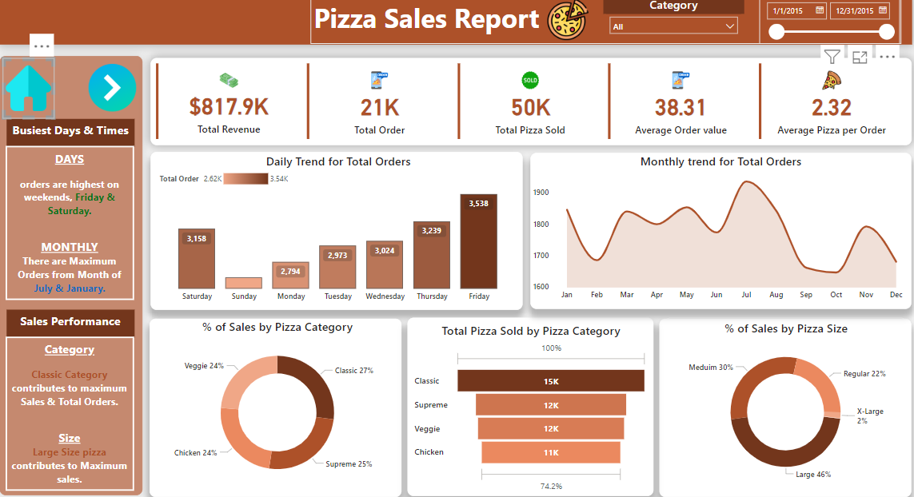
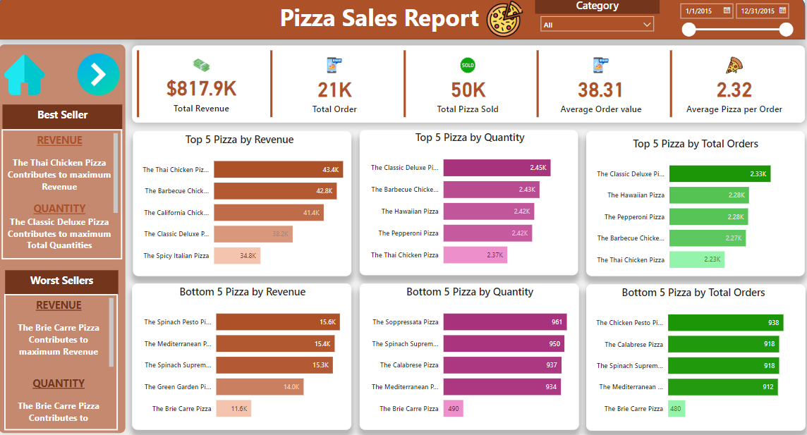

# Pizza Sales Dashboard

## Overview
This project presents an interactive **Pizza Sales Dashboard** designed to provide insights into sales trends, customer preferences, and business performance. The dashboard leverages visually compelling charts and key performance indicators (KPIs) to help stakeholders make data-driven decisions.

## Features

### Key Performance Indicators (KPIs):
- **Total Revenue:** $817.9K
- **Total Orders:** 21K
- **Total Pizzas Sold:** 50K
- **Average Order Value:** $38.31
- **Average Pizzas per Order:** 2.32

### Visualizations:
1. **Daily Trend for Total Orders**:
   - A bar chart showing order trends across days of the week.
   - Highlights the busiest days (Friday & Saturday).

2. **Monthly Trend for Total Orders**:
   - A line chart displaying monthly order trends.
   - Identifies peak ordering months (July & January).

3. **Percentage of Sales by Pizza Category**:
   - A pie chart showing the contribution of each pizza category to total sales.
   - Categories: Classic (27%), Supreme (25%), Veggie (24%), Chicken (24%).

4. **Total Pizzas Sold by Pizza Category**:
   - A funnel chart presenting the number of pizzas sold for each category.

5. **Percentage of Sales by Pizza Size**:
   - A donut chart visualizing sales distribution by pizza size.
   - Breakdown: Large (46%), Medium (30%), Regular (22%), X-Large (2%).

6. **Top 5 Best Sellers by Revenue, Quantity, and Orders**:
   - A bar chart identifying the top-performing pizzas.

7. **Bottom 5 Best Sellers by Revenue, Quantity, and Orders**:
   - A bar chart showcasing the underperforming pizzas.

## Dashboards

### Home

### Best/Worst Sellers

## Insights
- **Peak Sales Periods:** Sales are highest on weekends (Friday and Saturday) and peak during July and January.
- **Top-Performing Category:** The Classic category leads in both sales and total orders.
- **Popular Size:** Large-sized pizzas dominate the sales, contributing 46% of total revenue.
- **Opportunities for Improvement:** Strategies can be developed to improve the performance of the bottom 5 pizzas.

## Tools Used
- **Power BI**: For data visualization and creating the dashboards.
- **Excel**: For data cleaning and preparation.

## How to Use
1. Open the Power BI dashboard file to interact with the visualizations.
2. Explore different filters, including categories and time periods, to analyze specific aspects of the data.

## Contact
If you have any questions or suggestions regarding this project, feel free to reach out:

- **Email:** [bahaawanas427@gmail.com](mailto:bahaawanas427@gmail.com)  
- **LinkedIn:** [Bahaa Wanas](https://www.linkedin.com/in/bahaa-wanas-9797b923a) 
